# Programming Courses

Trabalho de Conclusão de Curso - UFCG de Kleberson Matheus Cunha Silva Canuto, orientado por Eliane Cristina de Araújo - UFCG.

## O sistema

O Programming Courses é um site que oferece cursos para o aprendizado inicial de programação, mais especificamente na linguagem Python. 

O site pode ser acessado a partir do link [http://programmingcourses.s3-website-us-east-1.amazonaws.com/](http://programmingcourses.s3-website-us-east-1.amazonaws.com/).

Para executar localmente, veja os README da [API](api/) e do [Frontend](programmingcourses/).
### Cadastro e Login

É possível realizar o cadastro (Imagem 1) no site e fazer Login (Imagem 2), liberando assim algumas funcionalidades extras, caso o usuário seja administrador, é possível ter acesso à área de administração (Imagens 3 e 4).

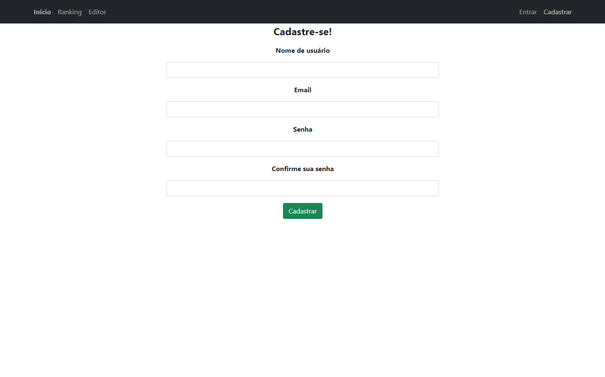

 <b> Imagem 1 </b> - Cadastro 

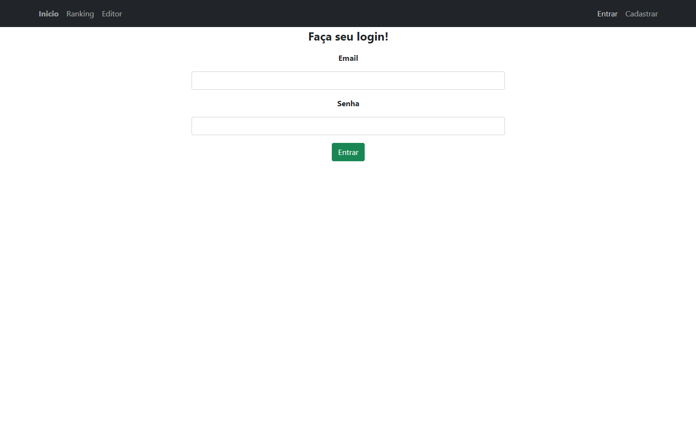

 <b> Imagem 2 </b> - Login 

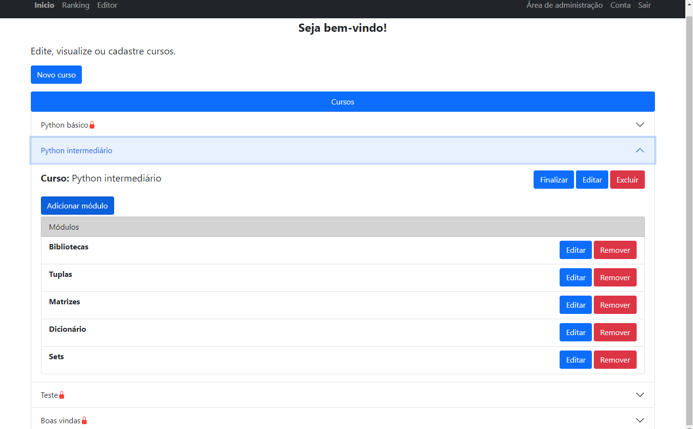

 <b> Imagem 3 </b> - Área de administração - Cursos 

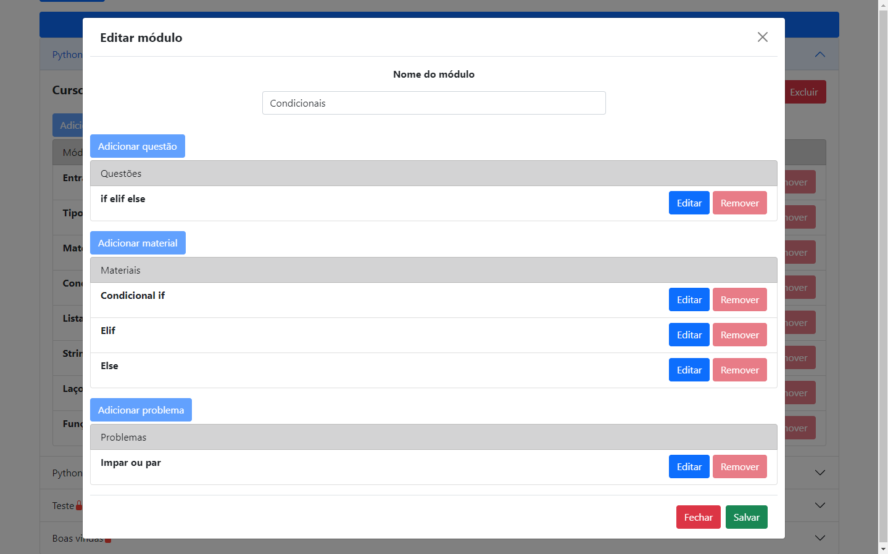

 <b> Imagem 4 </b> - Área de administração - Módulo 

### Área de desenvolvimento

A área de desenvolvimento livre (aba Editor) conta com um editor de texto simples, onde é possível escrever um código em Python e executá-lo, informando entrada caso seu programa necessite, para receber a saída no campo "Saída". Caso deseje uma execução mais detalhada, ainda é possível executar o código com o [Python Tutor](https://pythontutor.com/), onde é possível ver como é executado o código passo a passo, sendo possível observar a ordem de execução e as definições e mudanças de variáveis.

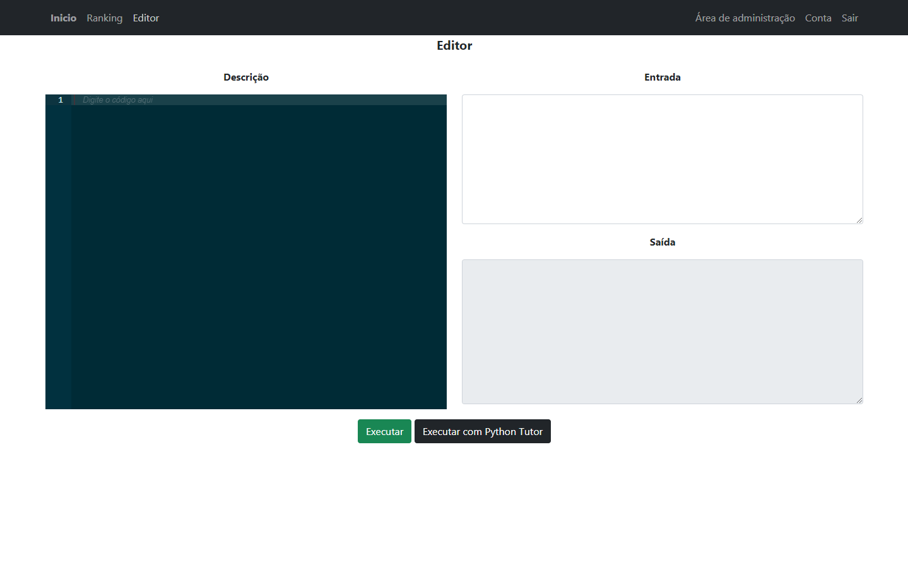

 <b> Imagem 5 </b> - Área de desenvolvimento 

### Cursos

A partir da tela inicial (Imagem 6), caso esteja logado, o usuário consegue acessar cursos (Imagem 7) em Python, cada cursos possui módulos, 

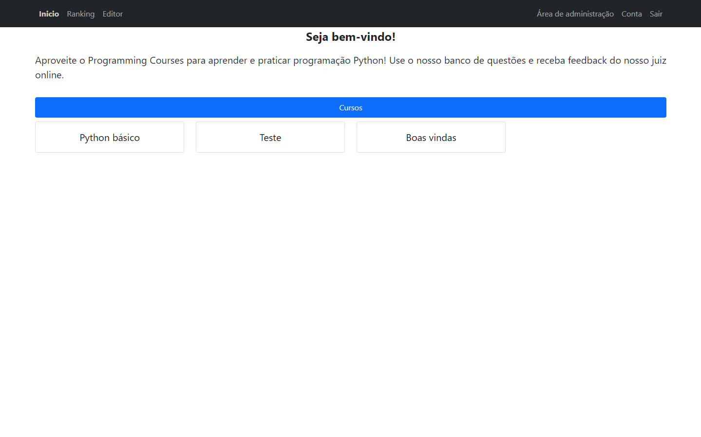

 <b> Imagem 6 </b> - Tela inicial 

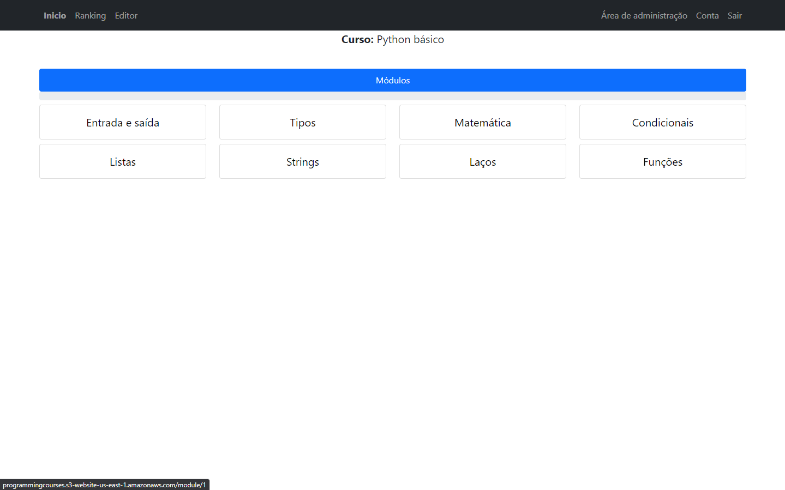

 <b> Imagem 7 </b> - Curso 

#### Módulo

O módulo (Imagem 8) em sua essência é um conjunto de materiais teóricos e práticos sobre um assunto de programação. Nele está contido materiais (teóricos), questões e problemas. 

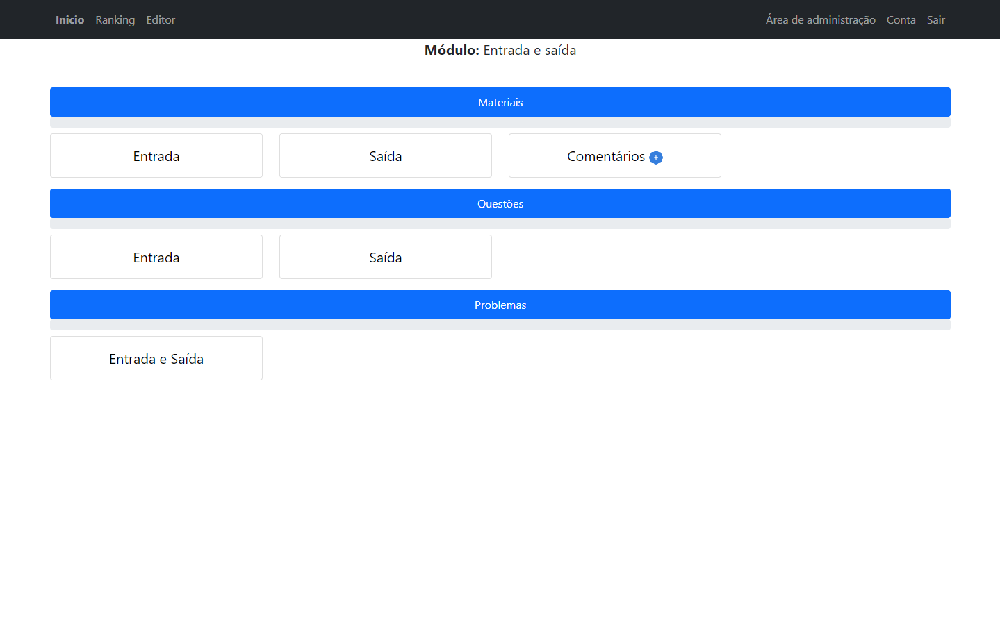

 <b> Imagem 8 </b> - Módulo 

##### Material

O material é um material teórico sobre um assunto, seu conteúdo pode ser em forma textual (Imagem 9) ou de vídeo (Imagem 10). Além disso, o material pode ser complementar, ou seja, não é essêncial para o módulo, mas pode ser de utilidade em um futuro.

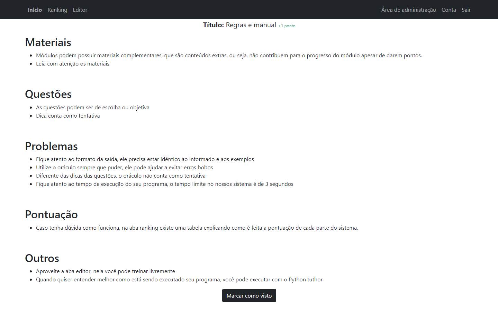

 <b> Imagem 9 </b> - Material textual 

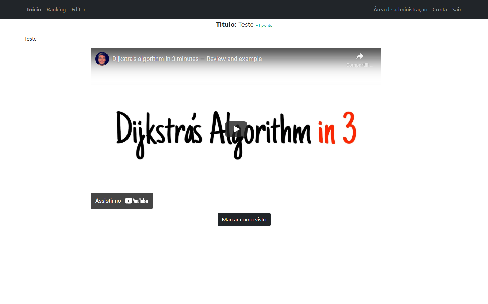

 <b> Imagem 10 </b> - Material em vídeo 

##### Questão

Questões (Imagem 11) são perguntas de múltipla escolha para o usuário, de forma a desafiar o conhecimento teórico dele. Caso ele sinta dificuldade, é possível pedir uma dica. 

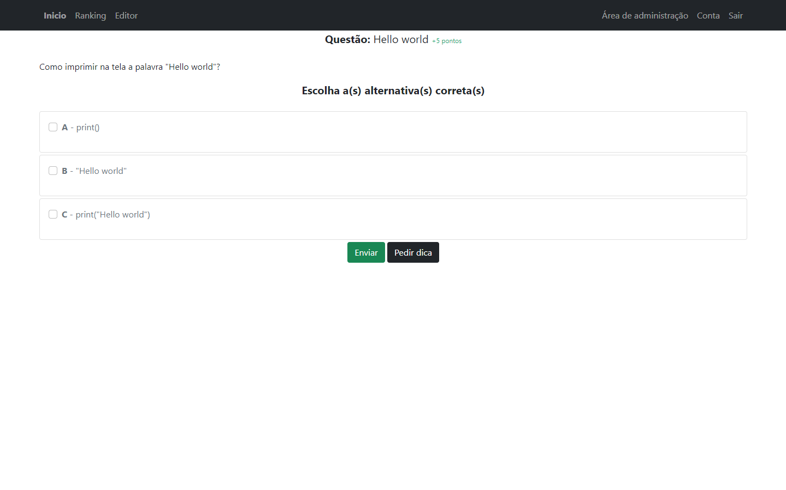

 <b> Imagem 11 </b> - Questao 

##### Problema

Problemas (Imagem 12) são questões do dia a dia que devem ser resolvidas de forma prática, com um código na linguagem Python, são mostrados na tela exemplos de entrada e saída esperada, facilitando o usuário a entender o problema. 

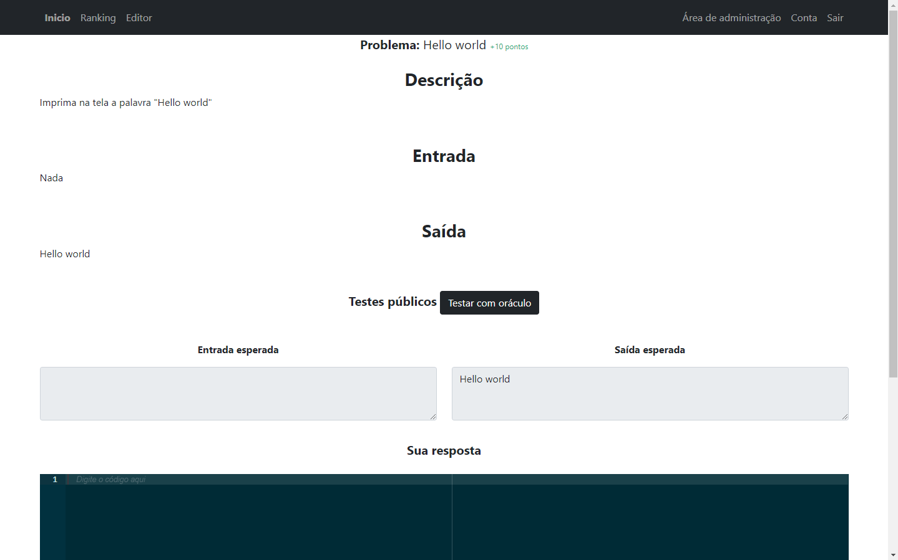

 <b> Imagem 12 </b> - Problema 

###### Oráculo

Caso sinta dificuldade em resolver um problema, o usuário pode utilizar o oráculo (Imagem 13), ele serve para validar se uma entrada dá a saída esperada por ele. Em caso do usuário nem saber a saída esperada, é possível ainda executá-lo no modo apenas entrada, onde é necessário informar apenas a entrada, e então a saída para aquela entrada será mostrada na tela. 

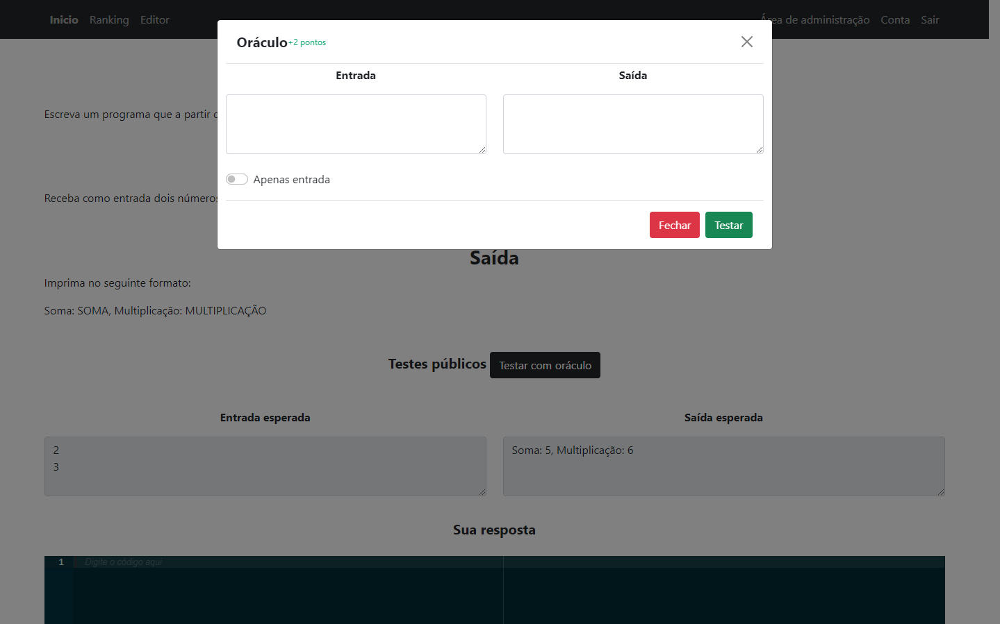

 <b> Imagem 13 </b> - Oraculo 

### Pontuação

Ao progredir nos cursos, o usuário recebe pontuação, essa pontuação é possível ser vista em um Rank com usuários (aba Ranking) (Imagem 14), onde é possível competir com outros usuários, é válido ressaltar que a pontuação a ser recebida diminuirá conforme as tentativas erradas em questões e problemas. Ainda na aba Ranking, é possível observar as diversas maneiras de pontuar (Imagem 15).

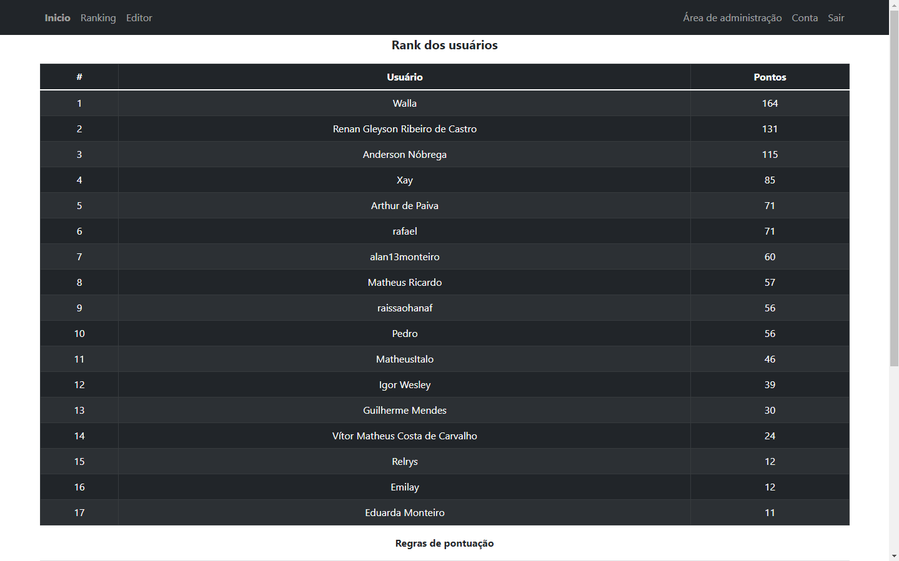

 <b> Imagem 14 </b> - Rank de usuários 

 <b> Imagem 15 </b> - Regras de Pontuacao 
