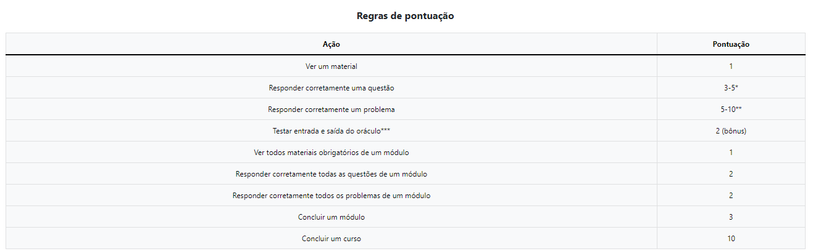

# Programming Courses

Trabalho de Conclusão de Curso - UFCG de Kleberson Matheus Cunha Silva Canuto, orientado por Eliane Cristina de Araújo - UFCG.

[TOC]

## O sistema

O Programming Courses é um site que oferece cursos para o aprendizado inicial de programação, mais especificamente na linguagem Python. 

#### Cadastro e Login

É possível realizar o cadastro (Imagem 1) no site e fazer Login (Imagem 2), liberando assim algumas funcionalidades extras, caso o usuário seja administrador, é possível ter acesso à área de administração (Imagens 3 e 4).

 <b> Imagem 1 </b> - Cadastro 

 <b> Imagem 2 </b> - Login 

 <b> Imagem 3 </b> - Área de administração - Cursos 

 <b> Imagem 4 </b> - Área de administração - Módulo 

#### Área de desenvolvimento

A área de desenvolvimento livre (aba Editor) conta com um editor de texto simples, onde é possível escrever um código em Python e executá-lo, informando entrada caso seu programa necessite, para receber a saída no campo "Saída". Caso deseje uma execução mais detalhada, ainda é possível executar o código com o [Python Tutor](https://pythontutor.com/), onde é possível ver como é executado o código passo a passo, sendo possível observar a ordem de execução e as definições e mudanças de variáveis.

 <b> Imagem 5 </b> - Área de desenvolvimento 

#### Cursos

#### Pontuação

 <b> Imagem </b> - Rank de usuários 

 <b> Imagem 5 </b> - Regras de Pontuacao 
